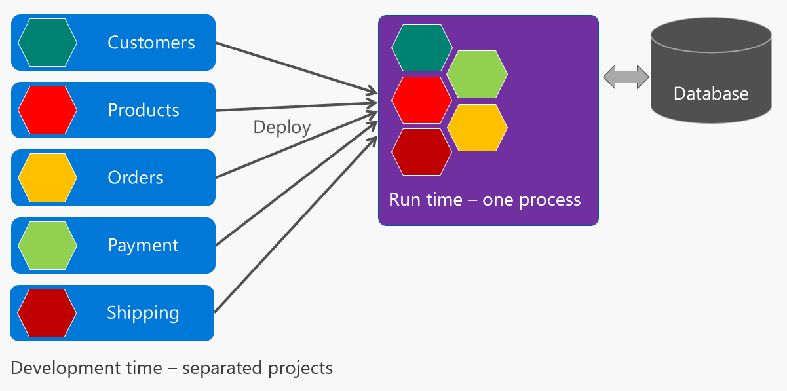
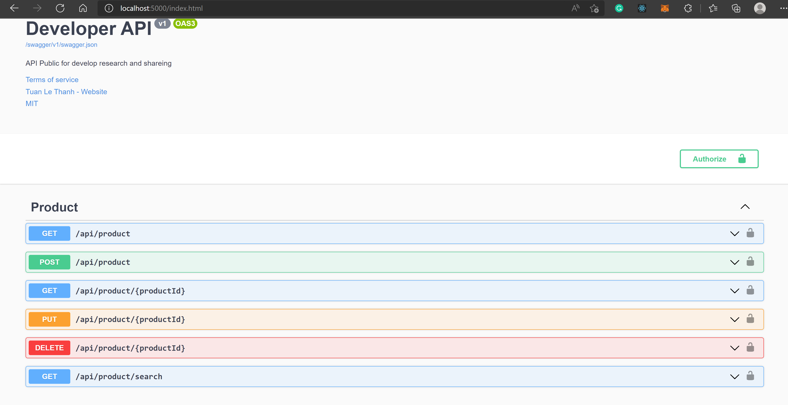
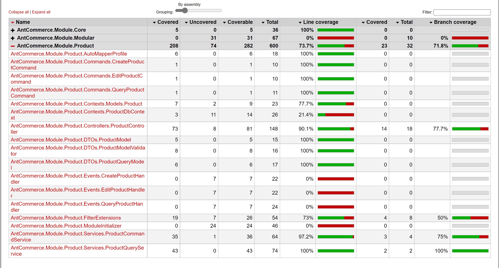
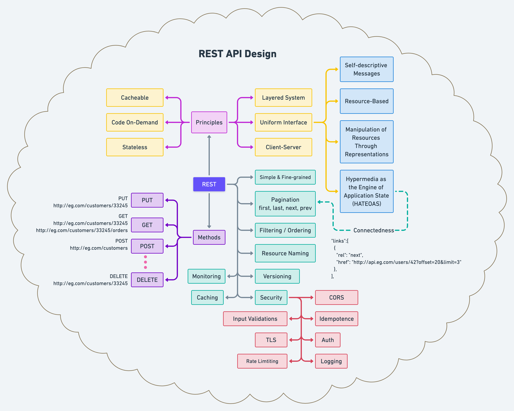

# Ant Commerce
The simple commerce with .NET Core.

### Build status

# High level architecture

# How to work

## Prerequisites
- .NET Core 6
- Visual Studio 2022
- SQL Server

## In this repository
- .NET Core
- Entity Framework
- Restful API
- SQL Server
- Swagger
- Serilog / Logging
- AutoMapper
- MediatR
- FluentValidation
- CQRS
- Unit tests (xUnit, NSubstitute, MockQueryable)
- Dockerfile

## Steps to run
Using Docker
> docker-compose up

Init Database
> docker exec -it  sqlserver  bash  /opt/script/init.sh

Using git clone

> git@github.com:tuanitpro/AntCommerce.git

> run sql/init-script to create table & data

> dotnet restore

> cd WebHost > dotnet run

Open browser then Enter 
> http://localhost:5001

## Demo
> https://product-api.tuanitpro.com
# Output result

# References

> https://blog.devgenius.io/best-practice-and-cheat-sheet-for-rest-api-design-6a6e12dfa89f
